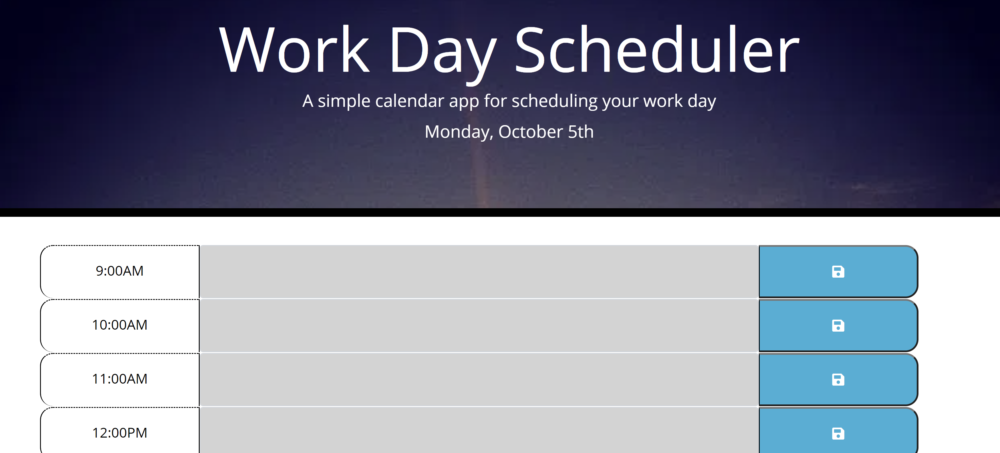

# Work-day-scheduler
* View the [Github Repo](https://github.com/girmaD/Work-day-scheduler)
* View the [Deployed Application](https://girmad.github.io/Work-day-scheduler/)
## Table Of Contents
* [Introduction](#Introduction)
* [Objective](#Objective)
* [Snap shot of the UI](#snap-shot-of-the-UI)
* [How To Use The App](#How-To-Use-The-App)
* [Contact](Contact)
## Introduction
This application presents a work day planning schedule. It renders a platform to write your hourly schedule from 9AM to 5PM. A user can write his/her hourly schedule and save it so that it will be saved and remain on the text box. This app runs in the browser and feature dynamically updated HTML and CSS powered by jQuery.

## Objective

The objective of this application to create a simple calendar application that allows a user to save events for each hour of the day by modifying starter code.

## Snap shot of the UI

## How To Use The App

When starting using the app, a user is displayed with today's day on top of the page and a text area to write his/her schedules on on each hour from 9AM to 5PM as well as a button to save ones the schedules are written.

Using this app simply requires writing ones hourly schedule and clicking the save button. If a user tries to save an empty textarea, the user will be prompted to write on the text area before saving it. The written schedules will remain on the text ara after saving it. A user has the option to rewrite his/her schedule if he/she wishes anytime.

The text area changes color based whether the time on the schedules is past, present or future. Grey text area indicates that time is behind us. A reddish text area means, the current time is on that scheduler time block. A greenish color indicates that time block lies in the future.

## Contact

Should you have any questions about this repo or the deployed page, contact me on [girma.derib@gmail.com](mailto:girma.derib@gmail.com)
